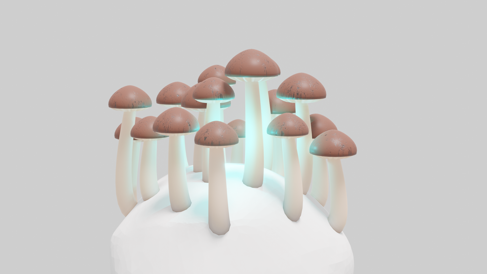

# Blender Mushroom Rock

This project houses a 3D model of a mushroom speckled rock.
It is using Blender 3.2's geometry nodes system to generate the mushrooms dynamically.

The mushrooms are designed to be **3D printable** with a generic SLA or FDM printer. I suggest you use a soluable support material (like PVA) to support the mushroom hats and maintain detail. Removing conventional support material, you might risk chopping of the mushrooms.

The stems cut through the underlying rock hull using geometry nodes as well. The stems are hollow and therefore perfectly fit a light-guide for illumination.

## Editing

Just open the `mushroom_rock.blend` file within Blender (https://blender.org) and you are ready to go.
To tinker around with the mushroom generator, go to the `Geometry Nodes` tab at the top and select the `MushroomStone` object.

To cover your own object with mushrooms, first ensure it has some *thickness*. E.g. you might apply a `Solidify` modifier first. Then add a new vertex group to the object and weight-paint all the surfaces where you want to have mushrooms growing.

Finally you can apply the `Geometry Nodes` modifier with the `MushroomStone` geometry nodes applied. Select your custom vertex group in the `density` group input field.

## Performance
Currently the geometry nodes are evaluated quite slow. This is due to the slow processing of the `Boolean` nodes present to cut the hollow space within the stem and the rock.

Open the `mushroom_rock_no_boolean.blend` for a version, where all `Boolean` nodes have been disabled. When hitting the spacebar, the mushrooms should animate in realtime within the viewport.

## Contact
Markus Wegmann, mw@technokrat.ch
